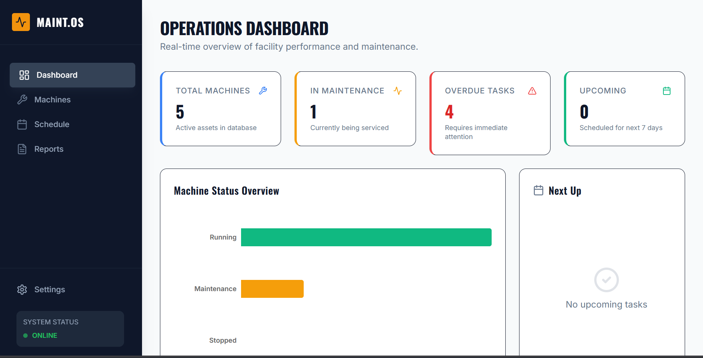
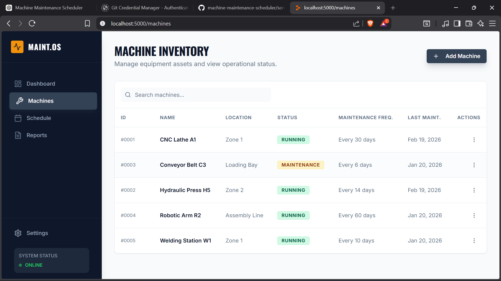

# 🏭 Machine Maintenance Scheduler

An end-to-end maintenance scheduling web application designed for manufacturing environments to manage machines, schedule maintenance tasks, track upcoming and overdue activities, and maintain service history.

Built using a modern full-stack architecture with REST APIs and persistent storage.

---

## 🚀 Features

### 🛠 Machine Management
- Add, edit, delete machines
- Track machine status (Running, Stopped, Maintenance)
- Auto calculate next maintenance due date
- Health score based on completed maintenance history

### 📅 Maintenance Scheduling
- Schedule maintenance tasks per machine
- View upcoming and overdue maintenance
- Complete tasks with technician notes
- Automatic maintenance history tracking

### 📊 Dashboard
- Total machines
- Machines under maintenance
- Overdue tasks
- Upcoming tasks

---

## 🖼 Application Screenshots

### Dashboard


### Machines Inventory


### Maintenance Scheduler


---

## 🧰 Tech Stack

**Frontend**
- React + TypeScript
- Tailwind CSS
- React Query
- Zod validation

**Backend**
- Node.js
- Express
- REST APIs

**Database**
- SQLite
- Drizzle ORM

---

## ⚙️ Installation & Run Locally

```bash
# Clone repository
git clone https://github.com/shrish-191/machine-maintenance-scheduler.git

# Install dependencies
npm install

# Run development server
npm run dev

#App runs at
http://localhost:5000

#Machines

GET /api/machines

POST /api/machines

PUT /api/machines/:id

DELETE /api/machines/:id

#Maintenance

GET /api/maintenance

POST /api/maintenance

POST /api/maintenance/:id/complete

#Dashboard

GET /api/stats/dashboard
